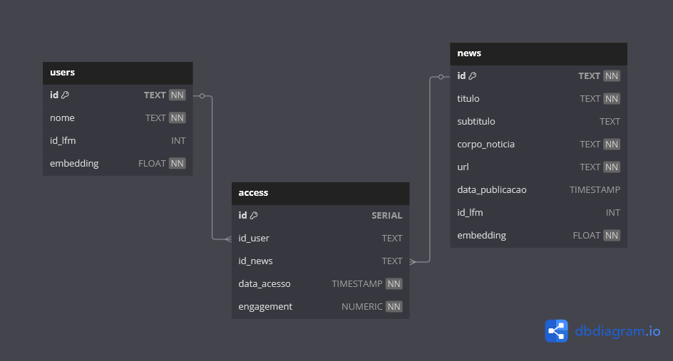

# Contêiner de banco de dados PostgreSQL(Sanctum)

Este serviço executa uma instância de banco de dados conforme o DEER. Esta é forma como a api esta configurada para funcionar em conjunto com o modelo.



## Tabelas
- `news`: Armazena as notícias prévias do treinamento do modelo e as cadastradas através do APP/API.
- `users`: Armazena os usuário prévios do treinamento do modelo e os cadastrador através do APP/API.
- `access`: Armazena cada acesso realizado por um usuário, inicialmente com dados de treinamento e posteriormente com os dados cadastrador pelo APP/API.

## Recursos

- Versão 16 do PostgreSQL em uma imagem pré-configurada
- Pré-configurado para uso imediato
- Armazenamento de dados persistente

## Como executar

### Pré-requisitos

- Docker instalado no seu sistema
- Docker Compose (opcional)

### Variáveis ​​de ambiente

```env
POSTGRES_USER=user
POSTGRES_PASSWORD=pass
POSTGRES_DB=db
```

### Executando o contêiner

```bash
docker run -d \
--name postgres-db \
-e POSTGRES_USER=user \
-e POSTGRES_PASSWORD=pass \
-e POSTGRES_DB=db \
-p 5432:5432 \
-v postgres_data:/var/lib/postgresql/data \
postgres:16
```

### Usando o Docker Compose

```yaml
versão: '3.8'
serviços:
db:
imagem: postgres:16
ambiente:
- POSTGRES_USER=user
- POSTGRES_PASSWORD=pass
- POSTGRES_DB=db
portas:
- "5432:5432"
volumes:
- postgres_data:/var/lib/postgresql/data

volumes:
postgres_data:
```
