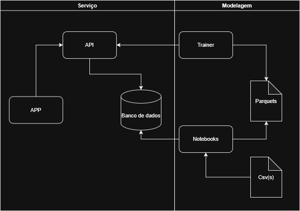

# Datathon

O presente repositório e a entraga do Datathon, atividade de Quinta fase do curso Pos Tech Machine Learning Engineering 

## Autores

- [@MarcioAjunior](https://github.com/MarcioAjunior)

## Atividade proposta

 - Criar/treinar um modelo de recomendação.
 - Salvar o modelo.
 - Criar uma API para servir o modelo, realizando previsões.
 - Empacotamento com docker.

## Sobre este trabalho

Para realização do trabalho, foram desenvolvidos notebooks para exploração dos dados, criação do dataser de treinamento, treinamento e validação e criação do modelo final. Os notebooks utilizados estão no pasta [notebooks](./notebooks) deste repositório. Para criação do modelo foi utilizada a biblioteca [LightFM](https://making.lyst.com/lightfm/docs/home.html) usada para criar sistemas de recomendação hibridos, Além disso foi criado um MVP para exemplificar a abordagem escolhidas para solucionar a atividade proposta.

### Video explicativo

### Arquitetura

A arquitetura pensada para resolver o problema em questão esta representada ana imagem abaixo.

### Como funciona

Os dados foram fornecidos para analise através de um conjunto de CSV(s), contendo notícias, acessos de usuarios a essas notícias. Com isso foram desenvolvidos notebooks para análise exploratória, onde também foi desenvolvida a modelagem. Com isso foi possível criar um ponto de iniciada do banco de dados, para que o memso não seja iniciado vazio, foi possível também desenovolver parquets que foram utilizados para a modelagem.
Para a modelagem foi montado um container chamado Trainer, reponsável por criar o PKL do modelo final. Este PKL engloba a classe do model já treinado e, com ele gerado, foi possível desenvolver a API, que é utulizado para servir o modelo, interagindo com obanco de dados e com o próprio modelo. Ao servir o modelo de recomendação em uma API foi possível desenvolver uma aplicação exemplificativa do funcionamento do ciclo de recomendação, permitindo assim motrar como features são utilizadas, atualizadas e como a interação entre usuarios e notícias foi realizado.

### Abordagem escolhida para o modelo

A abordagem escolhida para o desenvolvimento do modelo de recomendações foi a definição do gosto do usuário por embedding. Tratando também os itens/notícias como embeddings também. Para isso ser aplicado na modelagem foi necessário realizar algumas [engenharias de features](https://www.ibm.com/br-pt/think/topics/feature-engineering) sendo essas transformações:

- Tranformação do texto do título da notícia em um [embeddings](https://www.cloudflare.com/pt-br/learning/ai/what-are-embeddings/)(representação vetorial do texto).
- Transformação das features de: número de clicks na página, contagem de vezes que a página foi visitada, porcentagem de scroll da página e tempo na página em um score de engajamento sobre a notícia.
- Acrecimo da feature do gosto do usuário com embeddings.

Dessa forma foi possível inferir o gosto de um usuário, ponderando sua interação com a notícia com o seu score de engajamento, definindo o qual relevante aquela notíca é com base no seu histórico de acessos.
Os embeddings foram criados com TFIDF, permitindo que essa reomendação seja próxima a utiliza em abordagem como [similaridade do cosseno](https://arturlunardi.medium.com/entendendo-sistemas-de-recomenda%C3%A7%C3%A3o-c50a20856394) e passando essa responsábilidade do calculo da feature para o modelo LightFM.

Dessa forma foi possível realizado o que é proposto pelo LightFM, um modelo híbrido que considera a recencia de uma notícia, assim como sua popularida e o quao próximo o embedding dessa notícia é próximo ao embedding do usuário em questão.

### Sobre as Aplicações  

A arquitetura dispõe de quatro serviços principais, sendo eles:  

1. [**Banco de Dados**](./db)  
   Utilizado para armazenar novas interações e as utilizadas no treinamento. Também é a fonte de dados caso haja necessidade de um retreinamento e armazena, além das interações, novas notícias e usuários. Trata-se de um banco relacional PostgreSQL.  

2. [**Trainer**](./trainer)  
   Contêiner responsável pelo treinamento do modelo. Utiliza os arquivos Parquet gerados previamente para criar um arquivo PKL do modelo, tendo como única finalidade realizar esse treinamento.  

3. [**API**](./api)  
   A API é a forma escolhida para servir o modelo, utilizando uma arquitetura REST comum. Ela interage com o modelo previamente criado como uma classe e é responsável por processar chamadas de predição, registrar leituras de notícias, criar usuários e notícias, além de interagir com o aplicativo.  

4. [**APP**](./app)  
   Aplicação em React/Next.js desenvolvida para exemplificar como a API serve o modelo. Trata-se de uma demonstração simples de como um site de notícias poderia se beneficiar do modelo.  

Dentro de cada pasta, nomeada com o nome do serviço, há um arquivo README.md com mais detalhes sobre o serviço.

### Como reproduzir o experimento

### Próximos passos

